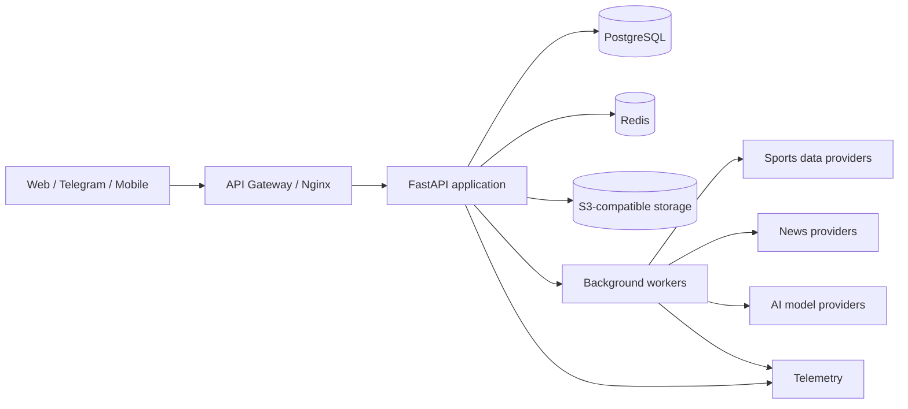

# Архитектура bet.score

## Подход

На этапе MVP применяется модульный монолит с FastAPI. Он минимизирует операционную сложность и сохраняет границы, по которым наиболее нагруженные компоненты позднее могут быть вынесены в сервисы.

## Слои backend

- `domain` — сущности и правила без инфраструктурных зависимостей;
- `application` — сценарии и порты;
- `infrastructure` — БД, Redis, внешние API и AI-провайдеры;
- `presentation` — HTTP, WebSocket и будущий SSE.

## Потоки данных

Ingestion получает данные поставщика, нормализует их в каноническую модель и
атомарно сохраняет snapshot вместе с transactional outbox. Отдельный dispatcher
доставляет outbox-события в Redis с at-least-once семантикой. AI pipeline читает
зафиксированный snapshot, формирует структурированный вывод и сохраняет
provenance. Клиенты получают invalidation через WebSocket, а восстановление
канонического состояния выполняют через REST.

## Масштабирование

- API остаётся stateless;
- PostgreSQL является источником истины;
- Redis используется для кэша, rate limiting и эфемерной доставки;
- тяжёлые операции выполняются очередями;
- данные партиционируются по времени и соревнованию после подтверждения профиля нагрузки;
- CDN и object storage обслуживают статические и крупные артефакты.

## Надёжность и безопасность

- OAuth/OIDC и Telegram init data завершаются серверной валидацией;
- секреты поступают только из окружения или secret manager;
- внешние вызовы имеют timeout, retry с jitter и circuit breaker;
- ingestion идемпотентен по provider/event/version;
- все AI-выводы аудируемы;
- логи структурированы и не содержат токены или персональные данные.
