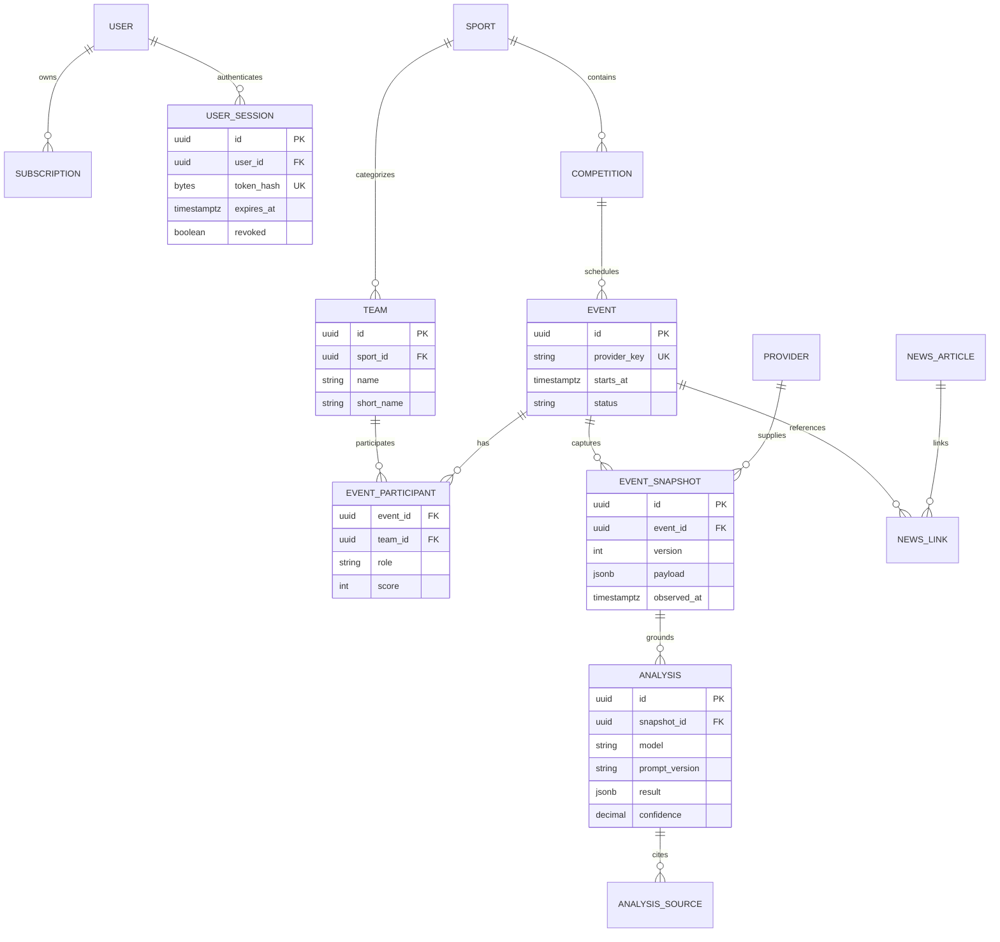

# Начальная модель данных

Физическая схема каталога уже хранит канонические команды, соревнования и события. Роль участника уникальна внутри матча, поэтому событие не может получить двух хозяев или двух гостей. Provider-specific идентификаторы будут добавлены отдельной таблицей соответствий после выбора поставщика.
