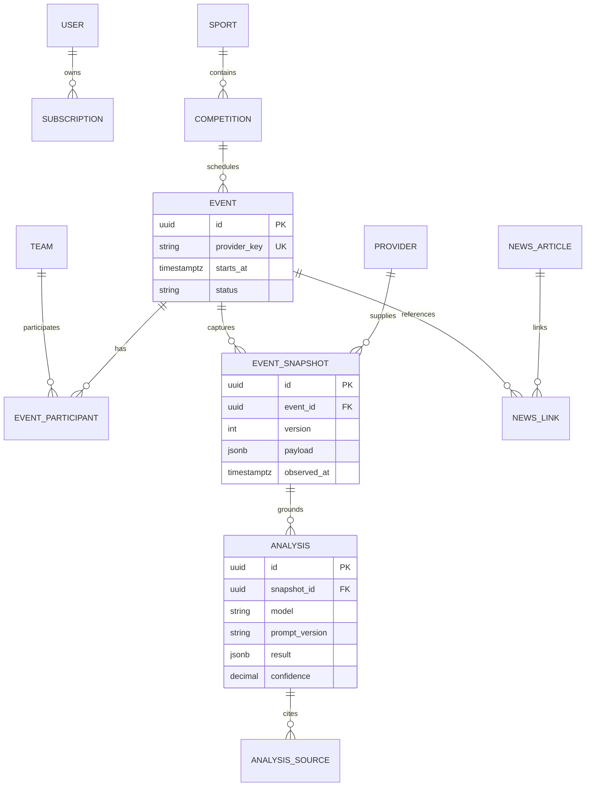

# Начальная модель данных

```mermaid
erDiagram
  USER ||--o{ SUBSCRIPTION : owns
  SPORT ||--o{ COMPETITION : contains
  COMPETITION ||--o{ EVENT : schedules
  TEAM ||--o{ EVENT_PARTICIPANT : participates
  EVENT ||--o{ EVENT_PARTICIPANT : has
  EVENT ||--o{ EVENT_SNAPSHOT : captures
  EVENT ||--o{ NEWS_LINK : references
  NEWS_ARTICLE ||--o{ NEWS_LINK : links
  EVENT_SNAPSHOT ||--o{ ANALYSIS : grounds
  ANALYSIS ||--o{ ANALYSIS_SOURCE : cites
  PROVIDER ||--o{ EVENT_SNAPSHOT : supplies

  EVENT {
    uuid id PK
    string provider_key UK
    timestamptz starts_at
    string status
  }
  EVENT_SNAPSHOT {
    uuid id PK
    uuid event_id FK
    int version
    jsonb payload
    timestamptz observed_at
  }
  ANALYSIS {
    uuid id PK
    uuid snapshot_id FK
    string model
    string prompt_version
    jsonb result
    decimal confidence
  }
```

Полная физическая схема будет создана после выбора первого вида спорта и поставщика. Канонические идентификаторы отделяются от provider-specific ключей.

